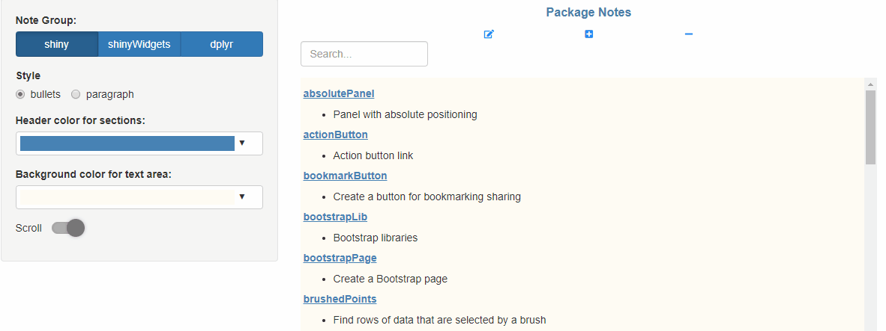
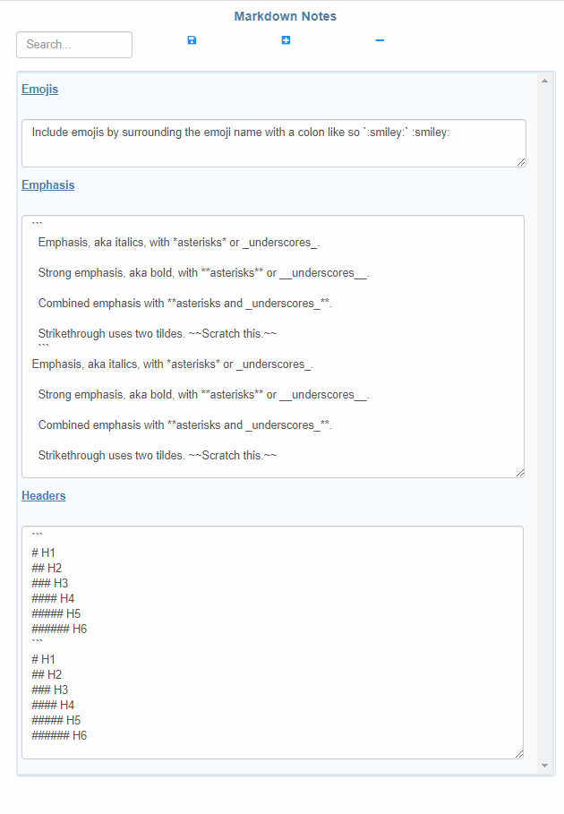

# shinyNotes
Shiny module for taking free-form notes and displaying them in a customizable UI.

The `shinyNotes` package is an enterprise-targeted scalable and customizable `shiny` module providing an easy way to incorporate free-form note taking or discussion boards into your shiny applications.

The package includes a shiny module, `shinynotes`, that can be included in any shiny application to create a panel containing searchable, editable text broken down by section headers of your choice.

## Installation

You may install the stable version from CRAN, or the development version using `devtools`:
```{r}
# install from CRAN
install.packages('shinyNotes')

# or the development version, via devtools
devtools::install_github('danielkovtun/shinyNotes')
```

## Usage

#### Demo Shiny Application
To start off, try running a demo Shiny application included with the package by running:
```{r}
library(shinyNotes)
runExample('demo')
```

#### Editing Notes
Notes can be directly modified by clicking the edit button and using the generated `textAreaInput` fields. To delete a note, simply remove all text from a `textAreaInput` and click save.



#### Adding Text Fields and Sections
You can add a new note to a section by clicking the "plus" button and selecting an existing category to add a note to. To add a new section header, fill in the inputs provided in the `modalDialog`. 


#### Custom Text Formatting with Markdown
A range of markdown text formatting is supported by `shinyNotes`. In addition to vanilla markdown, you can write inline math equations that are rendered with `MathJax` and even include emojis :exclamation: :astonished:



See the full documentation at https://danielkovtun.github.io/shinyNotes/. 
